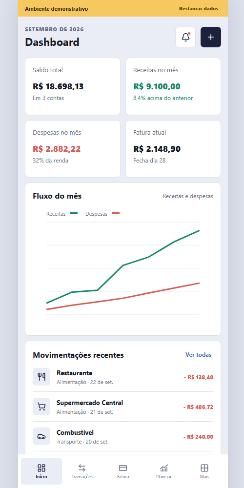
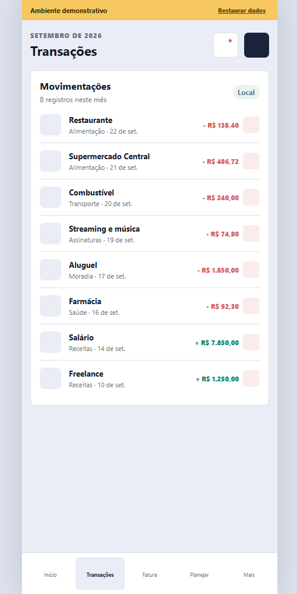
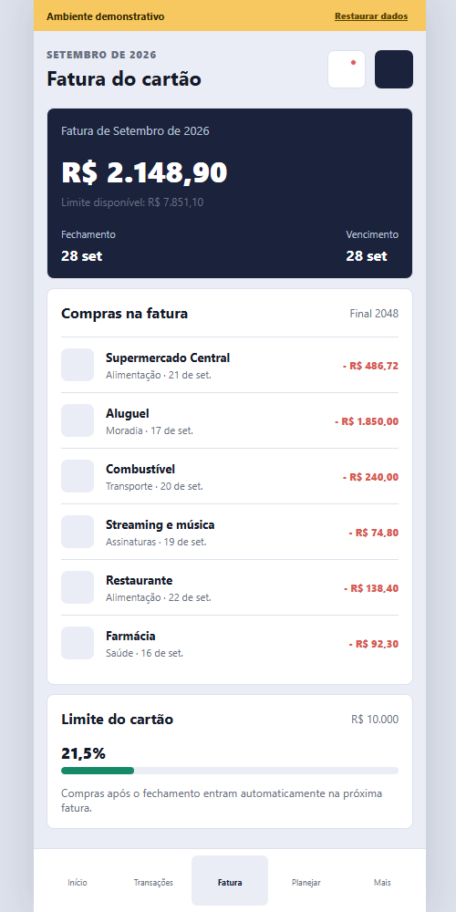
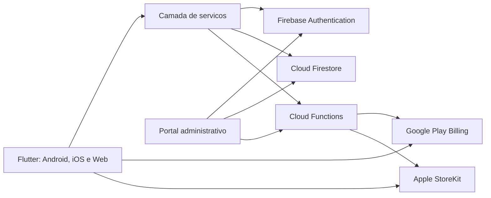

  

<h1 align="center">MegaCash</h1>

  <a href="https://play.google.com/store/apps/details?id=com.megacash.pessoal"><strong>Baixar no Google Play</strong></a>
  &nbsp;&nbsp;|&nbsp;&nbsp;
  <a href="https://apps.apple.com/app/id6778529478"><strong>Baixar na App Store</strong></a>
  &nbsp;&nbsp;|&nbsp;&nbsp;
  <a href="https://shiaulon.github.io/megacash-showcase/"><strong>Abrir demonstração</strong></a>

Aplicativo multiplataforma de gestao financeira pessoal, desenvolvido para transformar movimentacoes do dia a dia em uma visao clara de contas, cartoes, faturas, metas e patrimonio.

> Este repositorio e um showcase tecnico e de produto. O codigo-fonte, as credenciais e a infraestrutura de producao sao privados.

## Visao do produto

O MegaCash centraliza a vida financeira do usuario em uma experiencia disponivel para Android, iOS e Web. O produto foi construido com foco em sincronizacao entre dispositivos, clareza dos dados, seguranca e monetizacao por assinaturas.

## Demonstracao

**[Abrir demonstração interativa](https://shiaulon.github.io/megacash-showcase/)**

A demonstração funciona inteiramente no navegador, sem conta, Firebase ou dados reais. Datas, fatura e movimentações são recalculadas em relação ao mês atual. Alterações feitas pelo visitante ficam somente no armazenamento local do próprio navegador.

  

  
  

A interface adapta-se a desktop e celular, mantendo a navegação e os dados demonstrativos.

## Principais recursos

- Dashboard financeiro com visao consolidada.
- Contas bancarias, cartoes, transacoes e categorias.
- Controle de faturas com regras de fechamento e vencimento.
- Planejamento financeiro, metas e recorrencias.
- Graficos e relatorios para acompanhamento de gastos.
- Exportacao e compartilhamento de dados.
- Sincronizacao entre Android, iOS e Web.
- Login com e-mail, Google e Apple.
- Protecao biometrica e controles de sessao.
- Planos Basic e Pro, trial e cupons promocionais.
- Compras integradas pela Google Play e App Store.
- Portal administrativo com usuarios, plataforma e assinaturas.
- Experiencia localizada em portugues, ingles, espanhol e frances.

## Tecnologias

| Area | Tecnologias |
| --- | --- |
| Aplicativo | Flutter, Dart, Material Design |
| Estado e dados | Streams, RxDart, cache local e sincronizacao reativa |
| Backend | Firebase Authentication, Cloud Firestore e Cloud Functions |
| Seguranca | Firebase App Check, regras do Firestore e validacoes no servidor |
| Assinaturas | Google Play Billing, StoreKit e `in_app_purchase` |
| Autenticacao | E-mail, Google Sign-In, Sign in with Apple e biometria |
| Analytics | Firebase Analytics e monitoramento interno de leituras |
| Relatorios | FL Chart, PDF e CSV |
| Qualidade | Testes Flutter, testes de backend e analise estatica |
| Entrega | Google Play Console, App Store Connect e TestFlight |

## Arquitetura

As operacoes sensiveis permanecem no backend. O aplicativo solicita a compra, a loja processa o pagamento e o servidor valida o resultado antes de conceder acesso. Regras de seguranca limitam cada usuario aos proprios dados e separam as permissoes administrativas.

Uma explicacao mais detalhada esta em [Arquitetura](docs/ARCHITECTURE.md).

## Desafios resolvidos

### Assinaturas em duas lojas

Foi criada uma camada comum para representar planos, periodos, trials e promocoes, preservando as particularidades do Google Play Billing e do StoreKit. A validacao no servidor evita que o cliente seja a fonte de verdade da assinatura.

### Cupons e campanhas

O fluxo promocional relaciona campanhas a planos e ofertas configuradas nas lojas. Isso permite limitar elegibilidade, uso por usuario e quantidade de resgates, mantendo a renovacao posterior de acordo com as regras da loja.

### Sincronizacao e custo

Consultas foram organizadas por contexto, com cache e observacao apenas dos dados necessarios. Um monitor interno mede leituras por origem para identificar telas caras e orientar otimizacoes no Firestore.

### Regras de fatura

O dominio considera fechamento e vencimento separadamente. Compras feitas a partir do dia de fechamento sao direcionadas para o ciclo seguinte, evitando distorcoes no controle mensal.

## Minha participacao

- Concepcao e evolucao do produto.
- Arquitetura do aplicativo e do backend Firebase.
- Desenvolvimento Flutter para Android, iOS e Web.
- Modelagem do banco e regras de seguranca.
- Integracao de pagamentos e assinaturas nas duas lojas.
- Criacao do sistema de cupons e campanhas.
- Desenvolvimento do portal administrativo.
- Testes, investigacao de falhas e publicacao nas lojas.

## Privacidade deste repositorio

Este material nao contem:

- codigo-fonte do produto;
- chaves, certificados ou arquivos de ambiente;
- regras e funcoes completas de producao;
- IDs internos de produtos ou campanhas;
- dados pessoais ou financeiros reais.

O conteudo deste repositorio e protegido por direitos autorais. Consulte [LICENSE](LICENSE).

## Publicacao gratuita

Depois de enviar este repositorio ao GitHub, abra **Settings > Pages**, escolha **Deploy from a branch**, selecione `main` e a pasta `/ (root)`. O GitHub Pages publicara a demonstracao sem servidor e sem consumo do Firebase.

## Contato

Disponivel para demonstracao tecnica guiada e discussao sobre as decisoes de arquitetura, produto e monetizacao.
