

  

<h1 align="center">MegaCash</h1>

  <a href="https://play.google.com/store/apps/details?id=com.megacash.pessoal"><strong>Google Play</strong></a>
  &nbsp;&nbsp;|&nbsp;&nbsp;
  <a href="https://apps.apple.com/app/id6778529478"><strong>App Store</strong></a>
  &nbsp;&nbsp;|&nbsp;&nbsp;
  <a href="https://megacash-int.web.app"><strong>Versao Web</strong></a>
  &nbsp;&nbsp;|&nbsp;&nbsp;
  <a href="https://megacashpitch.web.app/demo"><strong>Abrir demonstracao</strong></a>

Aplicativo multiplataforma de gestao financeira pessoal criado para transformar movimentacoes diarias em uma visao clara de contas, cartoes, faturas, planejamento e patrimonio.

> Este repositorio e um showcase tecnico e de produto. O codigo-fonte, as credenciais e a infraestrutura de producao permanecem privados.

## Demonstracao ao vivo

**[Abrir a demo no visualizador mobile](https://megacashpitch.web.app/demo)**  
**[Abrir a aplicacao em tela cheia](https://megacashpitch-demo.web.app)**

A demo usa uma copia isolada do aplicativo Flutter Web e um projeto Firebase exclusivo, sem acesso a usuarios ou dados de producao. Cada visitante recebe uma sessao anonima com dados financeiros ficticios do mes atual e dos dois meses anteriores. As datas sao renovadas automaticamente, permitindo explorar dashboard, contas, transacoes e analises em qualquer mes.

## Telas do aplicativo

Capturas reais da demo Flutter Web em visualizacao mobile, com dados ficticios.

<table width="100%">
  <tr>
    <td align="center" width="33%"><strong>Dashboard</strong> 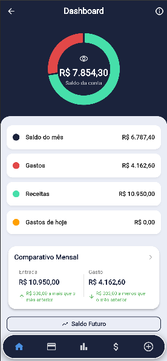</td>
    <td align="center" width="33%"><strong>Movimentacao</strong> 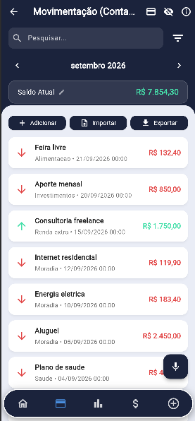</td>
    <td align="center" width="33%"><strong>Analise de gastos</strong> 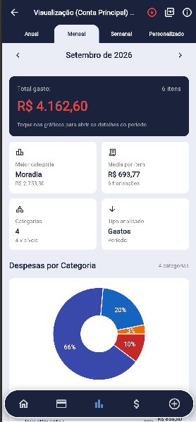</td>
  </tr>
  <tr>
    <td align="center"><strong>Planejamento</strong> 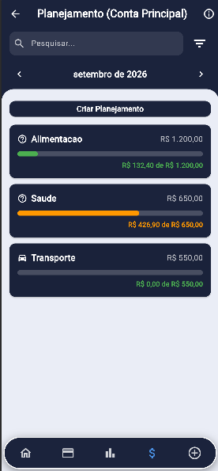</td>
    <td align="center"><strong>Patrimonio</strong> 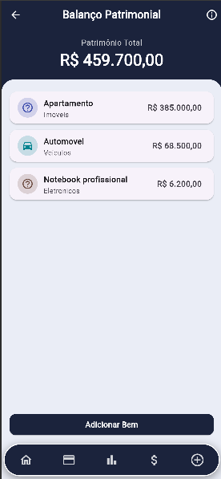</td>
    <td align="center"><strong>Mercado</strong> 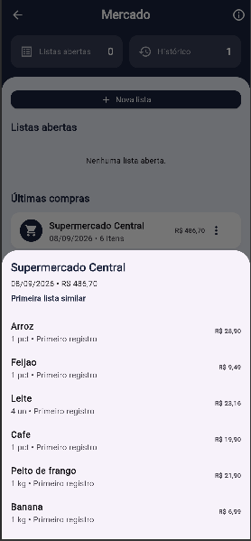</td>
  </tr>
  <tr>
    <td align="center"><strong>Exportacao</strong> 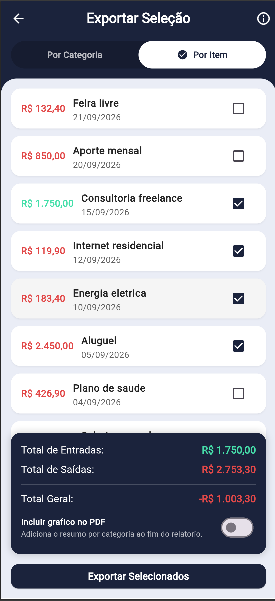</td>
    <td align="center"><strong>Saldo futuro</strong> 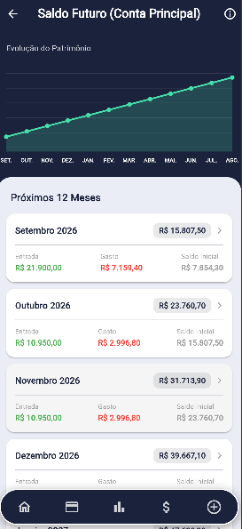</td>
    <td align="center"><strong>Comparativo mensal</strong> 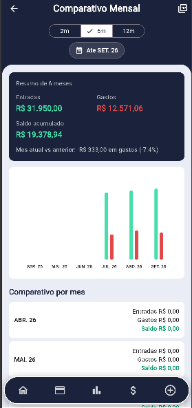</td>
  </tr>
  <tr>
    <td align="center" colspan="3"><strong>Contas a pagar</strong> 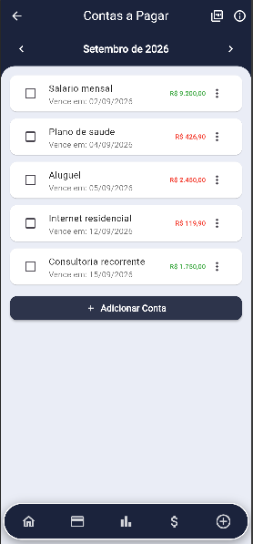</td>
  </tr>
</table>

## Principais recursos

- Dashboard financeiro consolidado e historico mensal.
- Contas bancarias, cartoes, transacoes e categorias.
- Faturas com regras de fechamento e vencimento.
- Planejamento financeiro, metas, recorrencias e orcamentos.
- Graficos, relatorios, exportacao em PDF e CSV.
- Sincronizacao entre Android, iOS e Web.
- Login por e-mail, Google e Apple, com protecao biometrica.
- Planos Basic e Pro, trial, cupons e compras nas lojas.
- Portal administrativo com usuarios, plataforma e assinatura.
- Localizacao em portugues, ingles, espanhol e frances.

## Tecnologias

| Area | Tecnologias |
| --- | --- |
| Aplicativo | Flutter, Dart, Material Design |
| Dados | Streams, RxDart, cache local e sincronizacao reativa |
| Backend | Firebase Authentication, Cloud Firestore e Cloud Functions |
| Seguranca | Firebase App Check, regras do Firestore e validacoes no servidor |
| Assinaturas | Google Play Billing, StoreKit e `in_app_purchase` |
| Analytics | Firebase Analytics e monitoramento interno de leituras |
| Relatorios | FL Chart, PDF e CSV |
| Entrega | Google Play Console, App Store Connect e TestFlight |

## Arquitetura

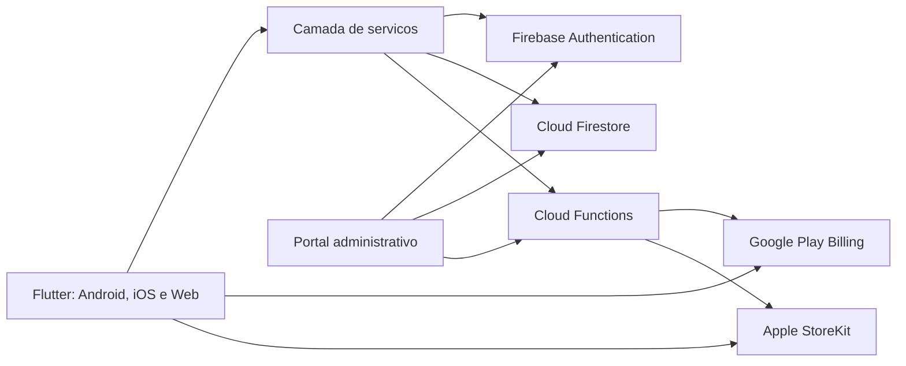

Operacoes sensiveis permanecem no backend. A loja processa o pagamento e o servidor valida o resultado antes de conceder acesso. As regras de seguranca limitam cada usuario aos proprios dados e separam permissoes administrativas.

Uma explicacao mais detalhada esta em [Arquitetura](docs/ARCHITECTURE.md).

## Desafios resolvidos

### Assinaturas em duas lojas

Uma camada comum representa planos, periodos, trials e promocoes, preservando as particularidades do Google Play Billing e do StoreKit. A validacao no servidor impede que o cliente seja a fonte de verdade da assinatura.

### Cupons e campanhas

O fluxo promocional relaciona campanhas a planos e ofertas configuradas nas lojas, com elegibilidade, limite por usuario, quantidade de resgates e renovacao posterior conforme as regras da plataforma.

### Sincronizacao e custo

Consultas sao organizadas por contexto, com cache e observacao apenas dos dados necessarios. Um monitor interno mede leituras por origem para orientar otimizacoes no Firestore.

### Regras de fatura

Fechamento e vencimento sao tratados separadamente. Compras feitas a partir do fechamento seguem para o ciclo seguinte, evitando distorcoes no controle mensal.

## Minha participacao

- Concepcao e evolucao do produto.
- Arquitetura Flutter e backend Firebase.
- Desenvolvimento para Android, iOS e Web.
- Modelagem de dados e regras de seguranca.
- Integracao de pagamentos e assinaturas.
- Sistema de cupons, campanhas e portal administrativo.
- Testes, diagnostico de falhas e publicacao nas lojas.

## Privacidade

Este showcase nao contem codigo-fonte do produto, credenciais, certificados, regras completas de producao, IDs internos ou dados pessoais reais. Consulte a [licenca](LICENSE).
