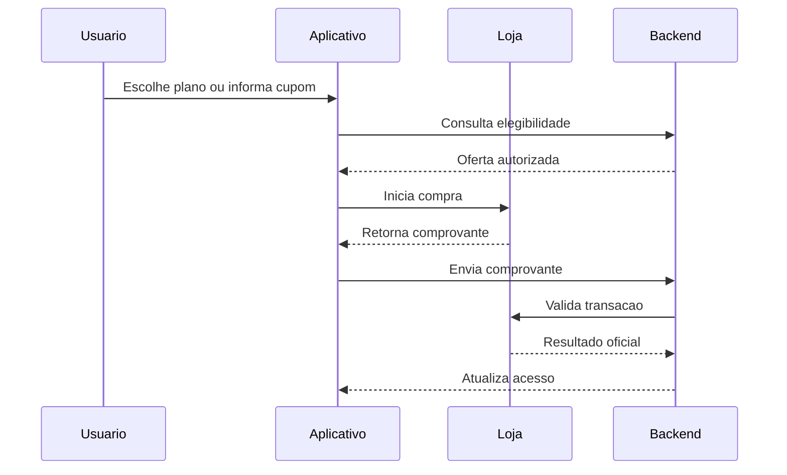

# Arquitetura do MegaCash

## Principios

- O backend e a fonte de verdade para acesso pago e operacoes sensiveis.
- Dados financeiros sao isolados por usuario.
- A interface compartilha a maior parte da base entre Android, iOS e Web.
- Integracoes de loja ficam encapsuladas em servicos especificos por plataforma.
- Consultas e listeners sao controlados para reduzir custo e consumo de recursos.

## Componentes

### Aplicativo Flutter

Responsavel pela interface, validacoes de experiencia, cache local e coordenacao dos fluxos. A camada visual nao concede privilegios de assinatura por conta propria.

### Firebase Authentication

Gerencia identidade e provedores de login. O identificador autenticado e usado pelas regras para restringir o acesso aos dados.

### Cloud Firestore

Armazena informacoes financeiras, configuracoes, estado de assinatura e dados administrativos. As estruturas reais e regras completas nao fazem parte deste showcase.

### Cloud Functions

Executa operacoes privilegiadas, prepara promocoes, valida condicoes de elegibilidade e processa integracoes que nao devem depender do cliente.

### Google Play e App Store

As lojas processam pagamentos e renovacoes. O MegaCash associa os produtos das lojas aos planos internos e valida o resultado antes de liberar os beneficios.

## Fluxo simplificado de assinatura

## Qualidade e observabilidade

- Analise estatica do Dart.
- Testes automatizados do dominio financeiro e das assinaturas.
- Testes de backend para elegibilidade e validacao.
- Trilhas internas para testes antes da producao.
- Analytics e monitoramento de leituras para diagnostico de comportamento e custo.

